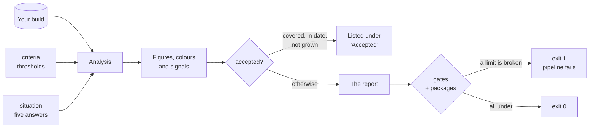
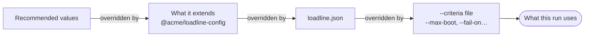
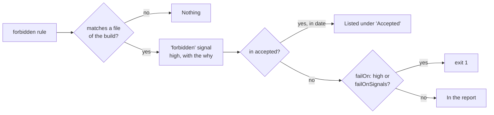
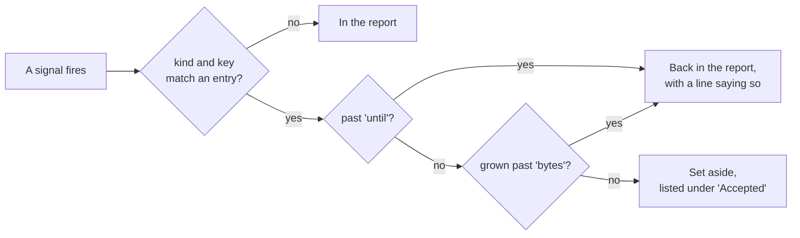

# Configuring Loadline — `loadline.json`

One optional file, committed next to your code, so the page and the command judge the build the
same way. Without it everything works with the recommended values and nothing ever fails.

**Find what you want to do:**

| I want to…                                                | Use                                   | Jump                                                |
| --------------------------------------------------------- | ------------------------------------- | --------------------------------------------------- |
| Make CI fail when the first load is too big               | `gates.maxBoot`                       | [Fail the build](#fail-the-build-on-size)           |
| Allow one heavy screen more than the others               | `gates.screens`                       | [One limit per screen](#one-limit-per-screen)       |
| Fail when a pull request makes things grow                | `gates.maxGrowth` + `--baseline`      | [Fail on growth](#fail-on-growth)                   |
| Stop new packages sneaking into the first load            | `packages` + `gates.failOnNewPackage` | [Guard the bootstrap](#guard-the-bootstrap)         |
| Fail on serious signals                                   | `gates.failOn`                        | [Fail on signals](#fail-on-signals)                 |
| Fail on one signal always, whatever its severity          | `gates.failOnSignals`                 | [Fail on signals](#fail-on-signals)                 |
| Never ship a package, or never in the first load          | `forbidden`                           | [Forbid something](#forbid-something)               |
| Share one file between many repositories                  | `extends`                             | [Share the configuration](#share-the-configuration) |
| Change what counts as good, fair or bad                   | `criteria`                            | [Thresholds](#change-the-thresholds)                |
| Live with a signal for now, without hiding it forever     | `accepted`                            | [Accept a signal](#accept-a-signal)                 |
| Tell Loadline how the team releases and who the users are | `situation`                           | [The situation](#answer-the-five-questions)         |
| See every key, its unit and its recommended value         | —                                     | [Reference](CONFIG-REFERENCE.md)                    |

## Start in thirty seconds

Create `loadline.json` at the root of the project — where you run `loadline` from:

```json
{
    "$schema": "https://unpkg.com/@bymaksym/loadline/loadline.schema.json",
    "tool": "loadline",
    "version": 1,
    "gates": { "maxBoot": "350kB" }
}
```

The first line is what makes the file easy: VS Code, WebStorm and most editors read the schema it
points at and then **complete every key, explain it on hover, list the allowed values and underline
a typo** as you type. `tool` and `version` are always those two values.

The command finds `loadline.json` in the working directory on its own; `--config <file>` points at
another one. The page reads it too when you drop it in with the build.

## How the file is used

Each block does one job. Only `gates` can make the command fail.



- **`criteria`** colour the figures and decide when a signal fires. They never fail anything.
- **`situation`** answers what no build can say — how often you release, who comes back. An answer
  can make a signal more serious, never less.
- **`accepted`** sets a signal aside with a reason and an expiry. It is still listed.
- **`gates`** turn figures and signals into an exit code. Without gates the command only reports.

### Who wins

A flag typed on the command line wins over the file, the file wins over what it
[extends](#share-the-configuration), and that wins over the recommended values. The page edits the
same thresholds and can export them as a block of this file.



### Sizes and shares

Write sizes the way you read them, anywhere in the file:

| You write            | It means                                       |
| -------------------- | ---------------------------------------------- |
| `"350kB"`, `"1.5MB"` | 350 × 1024 bytes, 1.5 × 1024 × 1024 bytes      |
| `358400`             | Bytes                                          |
| `"25%"` or `0.25`    | A share, for the criteria that are shares      |
| `350`, `"350"`       | **Refused**: 350 bytes is never what was meant |

Sizes are in the unit of the report — gzip when the build folder is there, raw otherwise. Set
`mode` to the unit you wrote them in: the command then reports in that unit (unless `--mode` says
otherwise), so a limit written in gzip is never checked against raw bytes. A `mode` the folder cannot
give — `brotli` with no `.br` files — stops the run with exit code 2.

### When something is wrong in the file

Nothing in the file is ignored in silence. A key that does not exist or a signal with no reason is
**printed** when the command runs, and the rest of the file still applies.

A mistake in `gates` is different: it **stops the run with exit code 2**, as the same mistake typed as
a flag does. A gate that cannot be read would otherwise not run, and a pipeline guarded by a gate
that does not run passes:

```text
loadline.json: "gates.maxBot" is not a gate, so it guards nothing. "gates.maxScreen" is 350, which
would be 350 bytes. Write "350kB", or "350B" if bytes are meant. That gate cannot run.
```

A file passed with `--config` that is not a `loadline.json` stops the run the same way.

## Fail the build on size

```json
"gates": {
    "maxBoot": "350kB",
    "maxScreen": "600kB",
    "maxOwn": "150kB"
}
```

| Gate        | Measures                                                  |
| ----------- | --------------------------------------------------------- |
| `maxBoot`   | What downloads before anything appears: the bootstrap     |
| `maxScreen` | Everything someone landing directly on a screen downloads |
| `maxOwn`    | The part only that screen loads                           |

```text
 what a screen downloads (maxScreen)
 ┌──────────────────────────────┬─────────────────┬───────────────┐
 │ bootstrap          (maxBoot) │ shared chunks   │ own  (maxOwn) │
 └──────────────────────────────┴─────────────────┴───────────────┘
```

The same gates exist as flags (`--max-boot 350kB`), which win over the file.

## One limit per screen

A map or an editor is heavy on purpose. Give it its own limit instead of loosening `maxScreen` for
every screen:

```json
"gates": {
    "maxScreen": "500kB",
    "screens": {
        "map": "900kB",
        "src/app/editor/editor.page.ts": "750kB"
    }
}
```

A screen is named as the report names it (the first column of the screens table) or by its source
file, which survives a rename of the route. A name that matches no screen is printed with the names
that do exist, so a renamed route cannot leave a limit guarding nothing.

## Fail on growth

```json
"gates": { "maxGrowth": "20kB", "maxGrowthPct": "5%" }
```

Growth needs something to grow from: pass the previous build with `--baseline`. The
[CI recipes in the README](../README.md#in-ci) keep the last build of `main` for exactly this. Each
screen is judged on what it adds beyond the bootstrap, and the bootstrap on its own, so one shared
change does not fail every screen at once.

## Guard the bootstrap

Bundles rarely grow all at once; they grow one `npm install` at a time.

```json
"packages": ["@angular/core", "@angular/common", "@angular/router", "rxjs"],
"gates": { "failOnNewPackage": true }
```

Any package in the first load that is not on the list fails the run, and adding one becomes a line
somebody reviews. Without `packages`, the gate compares against `--baseline` instead.

To find out why a package is there and where to cut it out:

```bash
npx @bymaksym/loadline dist/app/browser --why @microsoft/teams-js
```

## Fail on signals

```json
"gates": { "failOn": "high" }
```

`"high"` fails on the most serious signals only, `"mid"` on those and the medium ones, `"none"`
never. Before switching to `"mid"`, [accept](#accept-a-signal) the medium signals you have decided
to live with, or the first run will fail on them.

A level is the wrong tool for "this one, always". To fail on particular signals whatever their
severity, name them:

```json
"gates": { "failOn": "none", "failOnSignals": ["forbidden", "secrets", "vulnerable"] }
```

Each one that is raised is its own line in the log, so it says which signal stopped the run. The
names are the `kind` of each signal, listed in the [reference](CONFIG-REFERENCE.md#signals-kind-can-name).
Accepted signals do not count, here or in `failOn`. A name that is not a signal stops the run with
exit code 2: a typo there would be a gate guarding nothing.

## Forbid something

Every team has a rule like "no moment, we use date-fns" or "the admin area is lazy". Write it down
and Loadline checks it on every build:

```json
"forbidden": [
    { "package": "moment", "why": "We use date-fns. moment ships every language." },
    { "package": "lodash", "in": "bootstrap", "why": "Use lodash-es, and only in lazy screens." },
    { "path": "src/app/admin/*", "in": "bootstrap", "why": "Admin is lazy: someone imported it from the shell." }
]
```

| Field     |  Required  | What it is                                                                                                                |
| --------- | :--------: | ------------------------------------------------------------------------------------------------------------------------- |
| `package` | one of the | A package name. `*` stands for any text: `"@aws-sdk/*"`                                                                   |
| `path`    |    two     | Files of your project, with `*` as in [`build`](#when-it-reads-your-build-wrong): `"src/app/admin/*"`                     |
| `in`      |            | `"anywhere"`, the default: in no file of the build. `"bootstrap"`: not in the first load, a lazy screen may still load it |
| `why`     |    yes     | Why not, and what to use instead. It is the first thing on the signal                                                     |

Each rule that matches raises a **`forbidden`** signal of high severity. It says what matched, how
much it weighs, and the chain of imports that brings it in — the last file of yours in that chain is
the one to edit.



It is an ordinary signal on purpose, so nothing new has to be learnt to work with it:

- **To fail the build on it**, use `"failOn": "high"` or `"failOnSignals": ["forbidden"]`.
- **For an exception in one repository**, [accept](#accept-a-signal) it with a reason and a date. The
  `key` is the rule as you wrote it: `{ "kind": "forbidden", "key": "moment", "why": "…", "until": "…" }`.
- **When the rule no longer holds**, remove it from the list, in a review.

`packages` is the closed version of the same idea: everything not on that list fails. `forbidden`
is the open one: only what you name fails. A rule that cannot be read — no `why`, both `package` and
`path`, an `in` that is not one of the two — stops the run with exit code 2, like a broken gate.

## Share the configuration

With twenty repositories, write the rules once and have each repository extend them:

```json
{
    "$schema": "https://unpkg.com/@bymaksym/loadline/loadline.schema.json",
    "tool": "loadline",
    "version": 1,
    "extends": "@acme/loadline-config",
    "gates": { "screens": { "map": "900kB" } }
}
```

Five rules are all there is to it:

1. **What you write.** A path (`"./base.loadline.json"`) or a package (`"@acme/loadline-config"`,
   which reads that package's `loadline.json`). One name, or a list of them. A path is read from the
   folder of the file that writes it, so a base that extends another base works from any repository.
2. **Order.** First what you extend, then your file; in a list, left to right. **The last one wins.**
3. **How they join.** Objects — `criteria`, `gates`, `build` — key by key. **Lists add up**:
   `packages`, `accepted`, `forbidden`, `failOnSignals`, `build.entries`, `build.ignore`.
4. **What is not inherited.** `situation`: those are one team's answers, with its name on them. And a
   file cannot change the `mode` of what it extends: every inherited size would be read in the wrong
   unit.
5. **What stops the run** with exit code 2: a name that is not found, a file that ends up extending
   itself, a broken gate in any of the files, a `mode` that differs.

Lists add up because they are things a repository adds to: the packages the base allows, plus one;
the base's acceptances, plus its own. What adding cannot do is take something of the base away, and
the file already has the way to do that with a reason attached: an entry in `accepted`.

### See what it ended up as

```bash
npx @bymaksym/loadline --print-config
```

It prints the `loadline.json` the run uses, with everything it extends joined in — sizes in bytes,
which is what they are once read — and, on stderr, which files it came from. It needs no build:

```text
thresholds and accepted signals from loadline.json ← node_modules/@acme/loadline-config/loadline.json
```

**The page cannot follow `extends`**: it has no disk to look on. When the file you drop on it extends
others, the bar above the report says so, and the page applies only what that file says itself. Drop
what `--print-config` prints instead, and the page judges the build exactly as the command does.
When the page exports its thresholds from a file that extends a base, it writes only the ones that
were changed, so the export does not override every threshold of the base.

### Publish the shared file

A package with the file at its root, and nothing else:

```text
acme-loadline-config/
├── package.json
└── loadline.json
```

```json
{
    "name": "@acme/loadline-config",
    "version": "1.0.0",
    "files": ["loadline.json"]
}
```

If the package has an `"exports"` field, list the file in it — `"./loadline.json": "./loadline.json"`
— or Node will not let anything read it. Install it as a development dependency of each repository.
The base then moves only when somebody updates that dependency, in a commit, with the version in the
lock file: a shared threshold never changes under a build without a review.

Without a package, a path works too: `"extends": "../platform/loadline.json"` in a monorepo.

## Change the thresholds

Every rated figure has two thresholds. Up to the first it is **good**, up to the second **fair**,
above it **bad**:

```text
 bootstrap size
 0 ────────────────── bootOk ──────────────────── bootBad ──────────────────▶
        good                        fair                       bad
                     170kB (gzip)             350kB (gzip)
```

```json
"mode": "gzip",
"criteria": {
    "bootOk": "150kB",
    "bootBad": "300kB",
    "sharedRatio": "50%"
}
```

Anything you leave out keeps its recommended value. There are about forty thresholds; the
[reference](CONFIG-REFERENCE.md#criteria) lists each one with its recommended value in gzip,
brotli and raw.

The easiest way to tune them is the page: open the criteria panel, move the values until the report
looks right, and export them. The file you get is a `loadline.json` with only `mode` and `criteria`
— use it as it is, merge the block into yours, or pass it with `--criteria`.

## Accept a signal

When the team decides to live with something, write it down instead of switching the check off:

```json
"accepted": [
    {
        "kind": "dupes",
        "key": "date-fns",
        "why": "Two versions until the calendar library releases 4.x",
        "who": "@maks",
        "until": "2026-12-01",
        "bytes": "14kB"
    }
]
```



| Field   | Required | What it is                                                                      |
| ------- | :------: | ------------------------------------------------------------------------------- |
| `kind`  |   yes    | Which signal. The report prints it in grey after each one: `[dupes · date-fns]` |
| `key`   |          | Which instance. Leave it out to accept every instance — a bigger decision       |
| `why`   |   yes    | The reason. An acceptance without one is ignored, and said so                   |
| `who`   |          | Somebody a reader can ask in a year                                             |
| `until` |          | `YYYY-MM-DD`. After it the signal comes back                                    |
| `bytes` |          | The size that was agreed. If the signal grows past it, it comes back            |

The `kind` and `key` of every signal are in the text report (in grey after the signal's name) and in
`--format json` (`findings[].kind`, `findings[].key`). All the kinds are in the
[reference](CONFIG-REFERENCE.md#signals-kind-can-name).

## Answer the five questions

Some signals depend on things no build can tell — how often you release, whether people come back.
Answer them in the **Situation** tab of the page and export the block, or write it by hand:

```json
"situation": {
    "navigation": "allDay",
    "deploys": "weekly",
    "returning": "most",
    "connection": "office",
    "priority": "firstScreen",
    "answeredBy": "@maks",
    "answeredAt": "2026-10-01"
}
```

Every answer can also be `"unknown"`. The allowed values and what each one means are in the
[reference](CONFIG-REFERENCE.md#situation), and your editor lists them as you type.

## When it reads your build wrong

Loadline reads the build folder with rules about how tools write one: Vite, Rollup, esbuild,
SvelteKit, Nuxt, Stencil, Sapper, Polymer, Ember, RequireJS. A tool that writes something no rule
expects gets past them, and `build` is the way through without waiting for a release. Find the
symptom, add the line:

| What you see                                                                       | Add                                                                         |
| ---------------------------------------------------------------------------------- | --------------------------------------------------------------------------- |
| "No index.html … names a script", or the bootstrap is the wrong file               | `"entries": ["main.*.js"]` — where the application starts                   |
| A polyfill or a copy for old browsers counted as a screen                          | `"ignore": ["polyfills-*.js"]` — no screen downloads it                     |
| A tab, a modal or a widget listed as a screen                                      | `"screens": { "*.widget.ts": "piece" }`                                     |
| A screen missing from the table, under "not counted as screens"                    | `"screens": { "src/app/admin/*": "screen" }`                                |
| The folder holds several pages and the wrong one was read                          | `"page": "app.html"`                                                        |
| Code of yours under `node_modules/` listed as a package                            | `"own": ["src/node_modules/**"]`                                            |
| A workspace package or a vendored library counted as your code                     | `"dependencies": ["packages/*"]`                                            |
| Every lazy chunk is a screen, and "No route table was found" although there is one | `"routeKeys": ["page"]` — the key your router imports a route's chunk under |

```json
"build": {
    "entries": ["client.*.js"],
    "ignore": ["polyfills-legacy-*.js"],
    "screens": { "*.widget.ts": "piece", "src/app/admin/*": "screen" },
    "page": "index.html",
    "own": ["src/node_modules/**"],
    "dependencies": ["packages/*", "vendor/*"],
    "routeKeys": ["page"]
}
```

Names are file names or paths inside the build folder (for `screens`, the source file, or the chunk
when the folder has no source maps), and `*` stands for any text — the hash, a folder. What the
page's **not a screen** / **count as a screen** buttons say for one session, `screens` says for
everybody, and a click still wins over the file. What `ignore` leaves out is counted in the header
of the report, never dropped in silence.

For one run, `--entry <script>` on the command line says what `entries` says, and the page asks for
the script itself when the folder's page names none it reads; what it is given there goes into an
exported `loadline.json` like anything else.

`own` and `dependencies` are source paths, with `*` for a segment and `**` for any number of them,
matched from the start of the path. A file is yours unless it sits under `node_modules/`, and
Sapper's `src/node_modules/` — where an app keeps its own modules to import them by name — is read
as yours already. `dependencies` names the package after the folder its pattern matched:
`packages/*` makes `packages/ui/src/button.ts` part of a package called `ui`, which then shows in the
bootstrap by package, the duplicate check and every "imported by" like any other. When both match a
file, `own` wins. The two change what is counted as yours, so they move figures: the share of the
first load that is your code, the files a source map exposes, the signals about your own files.

`routeKeys` is for a router that hands a route its chunk under a key Loadline does not know. The
route table is found by its shape — an object with a `path` and a `component`, `loadComponent`,
`loadChildren`, `lazy`, `getComponent` or `asyncComponent` that imports the chunk — and a router
writing `{ path: "/orders", page: () => import("./orders.js") }` needs `"page"` here. Without the
table, every chunk loaded lazily counts as a screen. Only property names are taken.

## A complete file

```json
{
    "$schema": "https://unpkg.com/@bymaksym/loadline/loadline.schema.json",
    "tool": "loadline",
    "version": 1,
    "mode": "gzip",
    "criteria": { "bootOk": "150kB", "bootBad": "300kB" },
    "gates": {
        "maxBoot": "350kB",
        "maxScreen": "500kB",
        "screens": { "map": "900kB" },
        "maxGrowth": "20kB",
        "failOn": "high",
        "failOnNewPackage": true
    },
    "packages": ["@angular/core", "@angular/common", "@angular/router", "rxjs"],
    "forbidden": [{ "package": "moment", "why": "We use date-fns" }],
    "accepted": [
        {
            "kind": "dupes",
            "key": "date-fns",
            "why": "Two versions until the calendar library releases 4.x",
            "who": "@maks",
            "until": "2026-12-01",
            "bytes": "14kB"
        }
    ]
}
```

Read top to bottom: thresholds in gzip, the first load good up to 150 kB; the build fails over
350 kB of bootstrap, over 500 kB on any screen except the map, on 20 kB of growth against the
baseline, on any high signal — `moment` anywhere in the build is one — and on any package not on the
list; and one duplicated package is accepted until December, at up to 14 kB.
